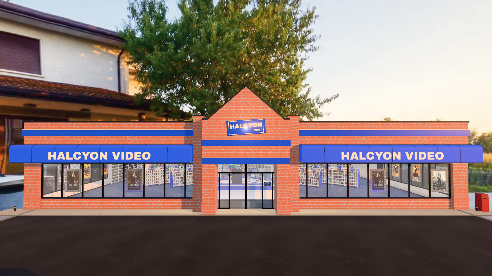
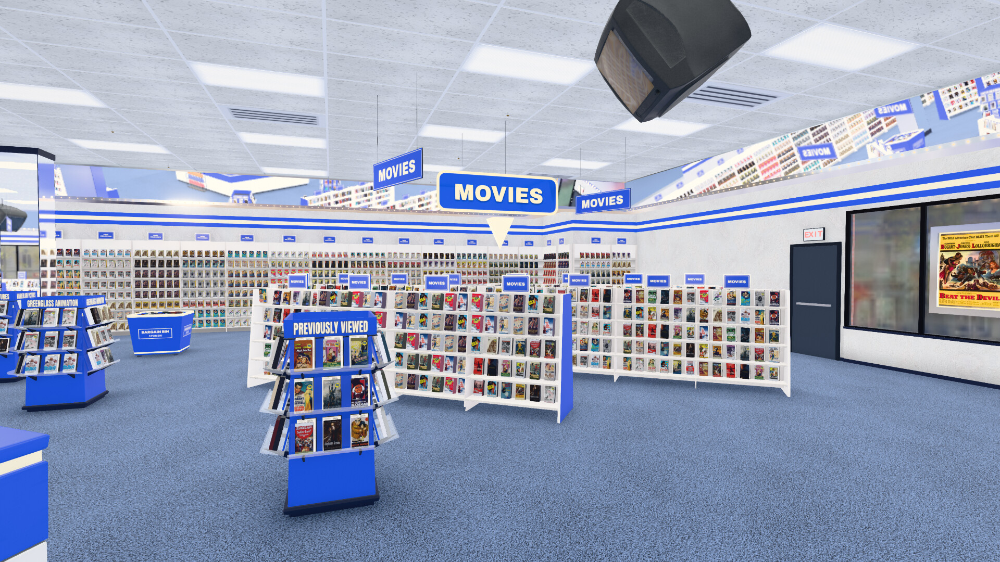
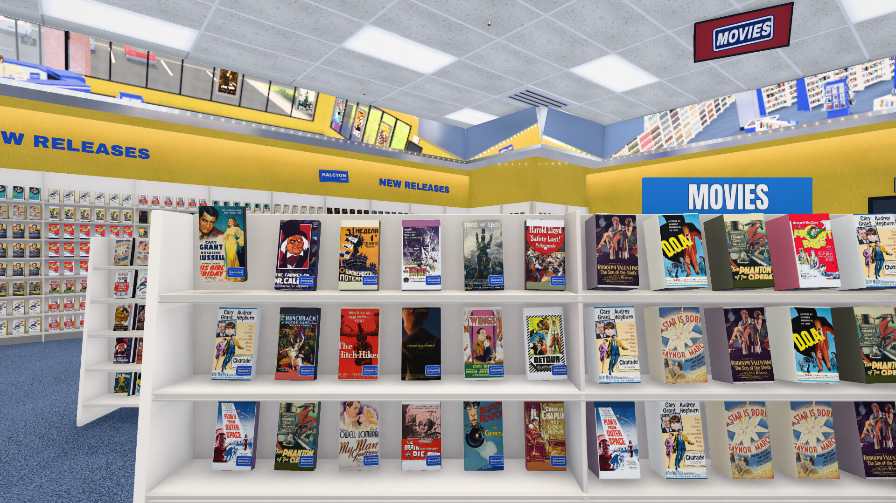
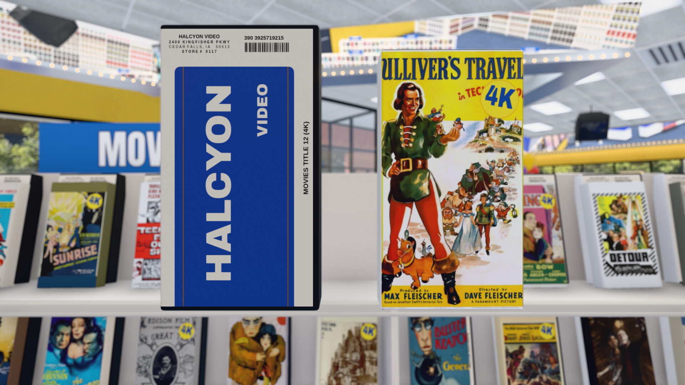
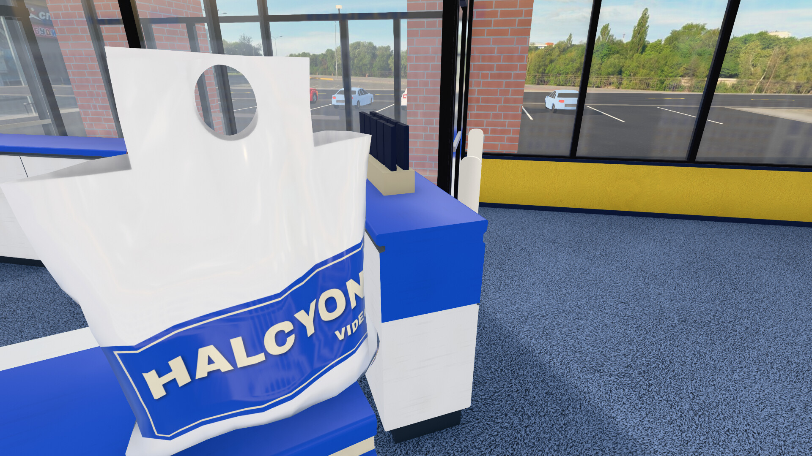
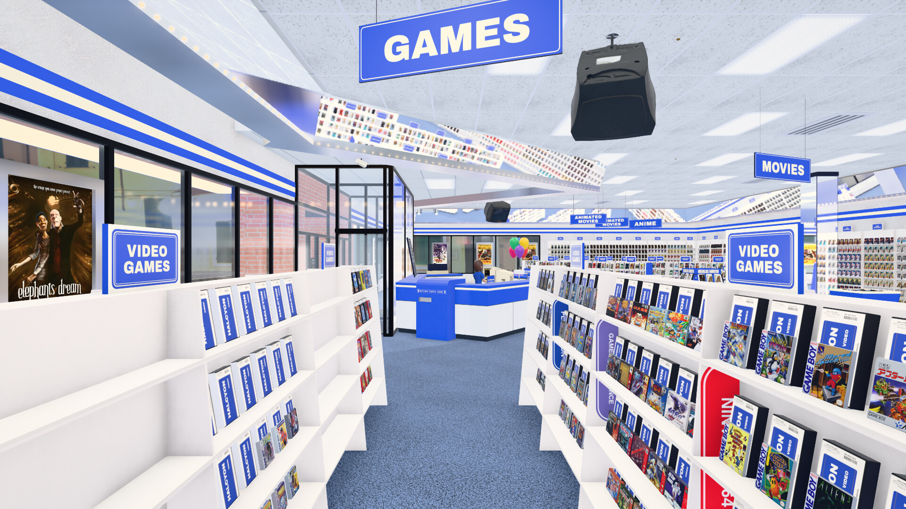
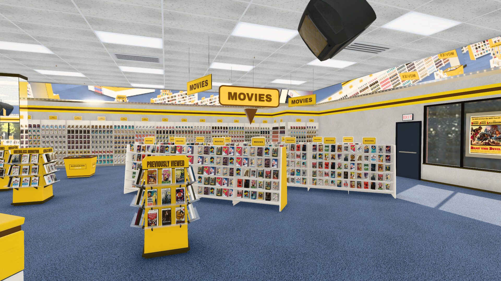

# Halcyon Video — walk your media library

[](https://discord.gg/SN6FnJgQe)
[](https://halcyon-video.github.io/halcyon-video/)
[](https://github.com/halcyon-video/halcyon-video/releases)
[](LICENSE)
[](https://github.com/halcyon-video/halcyon-video/stargazers)

**A walkable 3D video store for Jellyfin, Plex, streaming services, and RomM.**

Halcyon turns a media catalog into a place. Walk in from the parking lot,
browse physical aisles, pull a case from the shelf, read the back, ask the
clerk for a recommendation, and carry your picks to the counter. Then watch
in the built-in player, hand the file to mpv, or take the rental home to a
virtual living room.

It is not a grid menu wearing a nostalgic skin. It is a store.



**[Launch the hosted demo](https://halcyon-video.github.io/halcyon-video/)** —
no signup, media server, or API key required. It opens directly into a stocked
store; streaming titles link out to their services, while playback stays
disabled in the public demo.

Need help or want to show your store? Join the
[Discord community](https://discord.gg/SN6FnJgQe) for setup help, release
notes, and the `#your-store` gallery.

## A media library you can walk through



The room is built from your catalog. Libraries become aisles, genres become
sections, popular titles get deeper stock, and multiple quality versions
collapse into one box. Choose VHS or DVD cases, three shelf arrangements,
four period fit-outs, day through night lighting, and one of several modeled
storefronts without changing the library underneath.

Halcyon is meant to be used from the couch. A keyboard, gamepad, TV remote,
or phone can drive the same remote-first interface. First-person walk mode
adds mouse look and WebXR when a headset is available.

## The parts that make it feel like a store

### Browse, inspect, and search



Shelf browsing moves case by case without duplicate dead ends. Pick up a
title to see its real cover on a correctly proportioned rental shell, then
flip it for synopsis, cast, runtime, ratings, and a technical table generated
from the file's media streams. TV seasons use box sets, and the clerk's CRT
searches by title, director, or genre.



### Rent it, return it, or take it home



Carry several tapes to the counter and the clerk bags them in soft-body
plastic that deforms around the cases. The checkout sequence ends in a
living room with the rentals and receipt on the coffee table, ready for the
VCR. Optional rental mode adds period due dates and a lockout until the tapes
are returned through the counter chute.

### A clerk who knows the shelves

The clerk is rendered from an original Blender character model into a
directional sprite atlas. She walks the actual floor plan, restocks, works the
terminal, and comes to recommendation clasps around the store. Her reasons
come from the catalog and watch history — collections, directors, actors,
studios, and genres — rather than generated copy.

Connect Jellyseerr or Overseerr and she can also surface gaps in a collection,
shelve discovery titles as request cases, and place an order without leaving
the store.

### A real games department



Point Halcyon at [RomM](https://github.com/rommapp/romm) and enabled platforms
become a dedicated department. Cardboard cartons, clamshells, and jewel cases
use platform-specific proportions; native builds can hand a selected game to
an emulator.

### Make the store yours



The fictional Halcyon identity is data, not hard-coded scenery. Change the
name, colors, emblem, and typeface in the live Brand Editor and the storefront,
cases, aisle signs, counters, bags, and clerk livery repaint together. The
Emblem Studio builds a mark from editable shapes; an SVG or transparent PNG
can replace it entirely.

For a larger conversion, a brand pack can supply per-era palettes, fonts,
surfaces, and scanned wraps. Local assets live in the git-ignored
`public/user-assets/` directory, so a private store identity cannot wander
into a commit.

## What can stock the shelves?

| Source | What Halcyon does with it |
|---|---|
| **Jellyfin** | Movies, series, art, versions, playback, resume points, and watch history |
| **Plex** | The same core store through Plex code sign-in and server discovery |
| **Streaming services** | Zero-setup browsable aisles that link out to the selected service |
| **Jellyseerr / Overseerr** | Collection gaps, discovery stock, requests, and staff picks |
| **RomM** | Platform bays, game packaging, cover scans, and optional emulator launch |
| **Nothing yet** | A working opening-day store locally, or the stocked hosted demo |

Streaming aisles do not require Jellyfin, Plex, Jellyseerr, or a TMDB key.
The setup terminal asks which services you use and stocks them from a bundled
snapshot. A configured TMDB or Jellyseerr source can refresh that data later.
There is no built-in folder scanner; shelving personal files requires Jellyfin
or Plex.

## Watching something

Three routes cover three kinds of deployment:

- **Browser player:** direct streams when the browser can decode the file,
  HLS fallback when it cannot, audio and subtitle selection, resume points,
  and automatic next episodes.
- **HTPC with mpv:** a server running on the same machine can launch the local
  file in mpv for HDR, lossless audio, and native display handling.
- **Streaming aisle:** titles hand off to the provider's search or watch page;
  Halcyon does not impersonate a streaming player.

## Quick start

### Try it before installing

Open the **[hosted demo](https://halcyon-video.github.io/halcyon-video/)**.
It scales the demo catalog to the browser's measured GPU headroom, from a
smaller phone store to the full layout on a discrete GPU.

Development builds also include an opt-in [lightweight 3D prototype](docs/lightweight-prototype.md),
with a visible low-detail label and an on-demand full-quality comparison.

### Local launchers

Clone the repository, then run the launcher for your platform. It checks Node,
installs dependencies on first use, builds the app, serves it on port 1420,
and opens a browser.

| Platform | Launcher |
|---|---|
| Windows | `start.cmd` |
| macOS | `start.command` |
| Linux | `./start.sh` |

Pass `demo` to open the bundled catalog or `dev` for hot reload. The manual
equivalent is:

```sh
git clone https://github.com/halcyon-video/halcyon-video
cd halcyon-video
npm install
npm run dev
```

The opening-day terminal can connect Jellyfin or Plex, select streaming
services, or open the store empty and configure it later at the manager CRT.

### Docker

Use the published image:

```sh
docker run -d --name halcyon --network host --restart unless-stopped \
  ghcr.io/halcyon-video/halcyon-video
```

Or build from a clone with `docker compose up -d --build`. Host networking lets
WebRTC advertise an address other devices can reach; ordinary browser-only use
can publish port 1420 instead. The compose file documents GPU, allowed-host,
and optional shared-service settings.

### HTPC kiosk

```sh
./launch.sh
./deploy/install.sh
sudo loginctl enable-linger $USER
```

The kiosk service restarts after crashes, reloads for maintenance while idle,
and renders nothing when the store is still. Halcyon is designed to remain on
for days rather than burn the GPU behind an unchanged frame.

## TV, phone, and low-power screens

**Remote Play** streams the live canvas and audio over WebRTC while control
returns through the same connection. A shared mirror follows the living-room
store; private instances give remote visitors their own browser-rendered store.
Off-LAN sessions can use Halcyon's optional TURN relay. Read the
[wire protocol and deployment notes](docs/remote-play-protocol.md).

Android TV and Fire TV can use the native launcher in
[android-tv](android-tv/README.md). Apple TV has a documented
[native-client plan](tvos/README.md) but is not shipped. Roku is not supported.

For hardware that should not render the 3D room, **2.5D mode** presents the
same libraries and cases as HTML and CSS. It is the practical Raspberry Pi and
older-browser route, not a separate catalog.

## Updating

| Installation | Update command |
|---|---|
| Clone and launcher | `git pull`, then run the launcher again |
| Clone and npm | `git pull && npm install && npm run build` |
| Compose from this repository | `git pull && docker compose up -d --build` |
| Published container | Pull the new image, remove the old container, and recreate it |

This repository's compose file builds from the clone. `docker compose pull`
alone therefore does not fetch new application code.

## Privacy and network access

Halcyon is local-first. Your media-server login, library, watch history, and
private brand assets remain on your devices. Fonts, core textures, models, and
the streaming fallback snapshot ship with the app.

Optional features reach outside the local network only when used:

- streaming discovery may contact TMDB or Jellyseerr and load poster art;
- Remote Play performs WebRTC discovery and may use your TURN relay;
- streaming titles open their provider in a new page.

Server operators can provide RomM or Jellyseerr defaults through `HALCYON_*`
environment variables. Those credentials stay server-side and are injected
only into the small set of allowed proxy requests. Do not put shared secrets
in `VITE_*` variables on a public deployment; Vite embeds them in downloaded
JavaScript.

## Frequently asked questions

**Do I need a gaming PC?**

No. The renderer scales to the hardware and idles on a held frame. Low-end
devices can use 2.5D mode, while Remote Play lets a stronger machine render
for a phone or television.

**Can I use only streaming subscriptions?**

Yes. Select the services at opening day and the store stocks their aisles from
the bundled snapshot. A media server is needed only for personal files and
in-app playback.

**Can I make it look like the store I remember?**

Yes. Era, shelving, media format, facade, lighting, signage, fixtures, brand,
and case art are independent layers. The public project ships only its original
fictional identity; private reference-derived art stays in local user assets.

**Does Plex work?**

Yes. Choose Plex at the terminal, enter the short code at plex.tv/link, and
select a server. Shelves, playback, collections, resume points, and watch
history work through the Plex provider. Plex membership cards and cast-photo
wall decor are omitted because Plex does not expose those lists efficiently.

**What is not shipped yet?**

Emby support, a published desktop bundle, and the Apple TV client remain on
the roadmap. The source tree contains the Tauri shell and tvOS groundwork,
but neither is presented here as a finished download.

## Support and project policy

If Halcyon made you grin, the in-store tip jar links to
[Ko-fi](https://ko-fi.com/halcyonvideo). It is optional, switchable in Store
Look, and never gates a feature.

Bug reports are welcome. The project does not accept pull requests: it is a
single-owner product shared under an open license, not a design-by-committee
project. See [CONTRIBUTING.md](CONTRIBUTING.md) before filing.

Development builds must pass `npm run build`; the complete unit suite is
`npm test`.

## License

Halcyon Video is licensed under **GPL-3.0**. Fork it, modify it, and ship your
own store, while keeping distributed derivatives open under the same license.

Halcyon Video is an original fictional brand. This repository contains no real
video-rental chain's name, logo, trade dress, or typefaces. Demo movie art is
public-domain or CC-licensed and credited in
[`public/demo-posters/ATTRIBUTION.md`](public/demo-posters/ATTRIBUTION.md).
Screenshots of the games department use metadata from the author's private
RomM library. The project is not affiliated with any past or present rental
company.

The bundled streaming snapshot and live TMDB or Jellyseerr lookups contain
title data and poster art, not streaming-service logos. This product uses the
TMDB API but is not endorsed or certified by TMDB.
