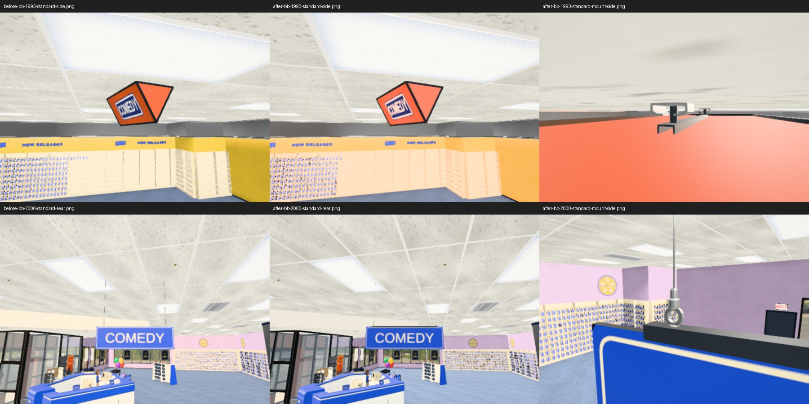

# Overhead sign suspension kit (#236)

Original generic hardware authored with Blender 5.2 using intentional extruded
folded-sheet profiles, annular eyes, turned cable grippers and closed wire/drop
meshes. This is not a measured historical replica. Existing scene measurements and the owner's
solid triangular wedge are the design references; no third-party assets or art
were incorporated. Original project asset, distributed under the repository license.

## Files and coordinates

- `tools/models/sign-mount.py`: reproducible authoring script; run Blender with an
  absolute script path if using the ThinkPad's Flatpak CLI wrapper.
- `tools/models/sign-mount.blend`: editable named parts in an exploded tray.
- `public/models/sign-mount.glb`: canonical parts at independent assembly origins.
- `tools/models/sign-mount-metrics.json`: source topology, dimensions and costs.
- `src/fixtures/sign-mount.ts`: registration and lifecycle at the existing sign anchors.
- `src/fixtures/sign-mount-layout.ts`: canonical part assembly and contact geometry.

One coordinate unit is one foot. Blender X is sign width, Z is height and -Y is
store depth; glTF exports Y-up. No additional metre conversion is applied at
runtime (the scene itself uses feet). The .blend display offsets are applied
AFTER export. Rerun the script to reproduce canonical GLB origins.

| Part | Dimensions / contact contract (feet) |
| --- | --- |
| TopChannel | 1 long, .064 deep, -.022 to +.032 high at sign top; .006 sheet thickness; .052 clear throat fits the .04 board |
| CeilingClip | .16 wide, .14 deep, -.048 to 0 below ceiling; folded spring saddle with returned lips |
| AttachmentEye | .068 outside diameter, .042 opening, .018 thickness; bottom .032 touches channel top |
| WireConnector | .038 maximum diameter, .088–.160 height above sign top; central .008 bore |
| SuspensionWire | .007 diameter, unit length; only length scales |
| RigidDrop | .028 square, unit length; only length scales |
| Fastener | .036 maximum head diameter, .025 height; bored/chamfered collar |

Channels scale only along width: .86 × board width or .55 × wedge width. Board
supports keep the established ±(width/2 − .4) spacing. Wedge drops stay at
±.24 × width, with the existing .18-foot ceiling-to-body gap. Rigid drops reach
from the channel's inner roof to the clip's underside. Each clip resolves the
visible ceiling surface with a short upward ray around the nominal deck, so
the recessed tile/troffer thickness cannot bury it. Hidden surfaces are ignored;
an exposed roof within .5 ft above the deck is eligible. This adjusts hardware
only, never the wedge body. Cable passes through the
gripper and ceiling fastener. Eyes and cable fittings remain fixed size. Board
shear, if supplied, translates the mounting kit to its top-edge offset.

`MountChannel` is charcoal coated metal; `MountSteel` is satin zinc/steel.
Both are named PBR roles, with UV islands on every mesh and no texture images.
All individual solid parts pass Blender manifold and positive-face-area checks.
The 616-triangle, 43,960-byte library has seven meshes and two materials; runtime
only retains parts used by each assembly. Dimensions/profiles are intentionally
modest hardware detail, not structural engineering specifications.

| Runtime hardware only | Triangles | Draw calls | Unique geometries | Materials / textures |
| --- | ---: | ---: | ---: | ---: |
| Board kit | 1,516 | 13 | 6 | 2 / 0 |
| Wedge kit | 508 | 7 | 4 | 2 / 0 |
| Original board wires | 48 | 2 | 1 | 1 / 0 |
| Original wedge bar/drops | 36 | 3 | 3 | 1 / 0 |

Twinned fittings share geometry and material objects within each sign. The
fallback remains allocated for normal fixture ownership but is hidden on success.
Costs above exclude the unchanged sign body and print textures.

## Integration and preservation

The two existing builders register their procedural hardware as a fallback;
`signage.ts` installs the kit only after the fixture enters the scene. The shared
`installDisplayModel` loader resolves the base path, hides fallback on success,
refreshes rendering/shadows, and retains fallback on network failure. Removing
the sign cancels pending adoption and releases loaded geometry/materials once
per resource before ordinary signage cleanup traverses the fallback and body.
No global GLB resource cache or texture ownership is introduced.

The sign body, readable front/back print, art replacement, category colors,
trim, equilateral end caps, wedge proportions, slot yaw, era gates and all
interaction/collision registration remain unchanged. Aisle and games slots now
pass their actual main ceiling or soffit height; the consumer otherwise defaults
to the live context ceiling rather than a hard-coded 13.5 feet. The unused legacy
die-cut cap path remains procedural; it is not the solid 1993 wedge consumer.

## Verification

`tools/verify-sign-mount.mjs` follows the existing StoreScene photograph harness,
using isolated settings, an isolated Vite server and an independent dependency
cache with HMR disabled. It photographs both themes
under standard/high ceilings from front, side, rear and hardware detail angles.
The before run uses archived HEAD sources, preventing HMR from mixing revisions.
See the issue outbox report for inspected photographs, lifecycle/mesh checks,
and test/build outcomes.

Final verification: 711 tests and production build passed. The browser loader
checks passed success, network failure, early removal and one-time resource
release. In-store tile contacts measured 13.43 ft under the standard deck and
17.93 ft under the raised deck; nominal wedge body positions were preserved.

